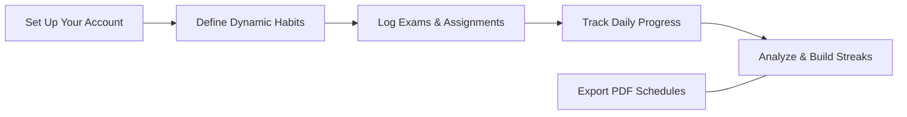
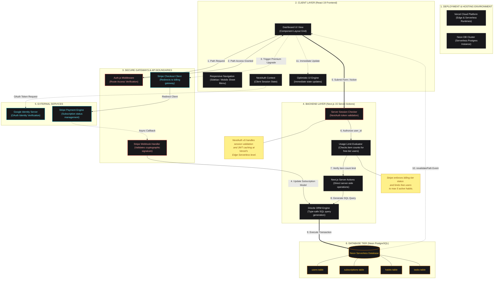

# smart-track

<p align="center">
  <strong>Stop losing track of your deadlines. Know your tasks, master your habits, and perform with clarity.</strong>
</p>

<p align="center">
  smart-track gives you a clear, calm view of your entire academic and daily life—exams, assignments, and habits—all in one place. No more switching between apps, lost sticky notes, or forgotten routines. Just open smart-track, plan your day, build your streaks, and focus on what actually matters.
</p>

<p align="center">
  
  
  
  
  
  
  
</p>

## The Story Behind smart-track

Students and self-learners handle multiple streams of complex information every day—upcoming exams, homework assignments, daily routines, and notes. When these get scattered across different apps, physical notebooks, and reminders, it quickly leads to mental fatigue, stress, and missed deadlines.

We built **smart-track** to unify these streams into a single, cohesive, and calm workspace. It acts as a digital anchor for your goals. Whether you are prepping for midterms, building a daily reading habit, or tracking a project, smart-track organizes the chaos so you can learn and build with peace of mind.


## Table of Contents

- [Why It Matters](#why-it-matters)
- [User Experience](#user-experience)
- [How It Works](#how-it-works)
- [The Architecture](#the-architecture)
- [Project Structure](#project-structure)
- [Technology Stack](#technology-stack)
- [Getting Started](#getting-started)
- [Project Lead](#project-lead)


## Why It Matters

Most planner applications feel overly complex and cluttered. They force you to spend more time setting up templates and checking off boxes than actually doing the real work. Over time, these planners get abandoned because they add to the overwhelm.

**smart-track** changes that by keeping things simple, direct, and focused on execution:
- **Clarity Over Chaos:** Your daily habits, assignment deadlines, and exam milestones live side-by-side, giving you an immediate picture of your day.
- **Consistent Habits:** Visual streak counters motivate you to maintain consistency in your daily routines, from physical health to learning schedules.
- **Proactive Planning:** Dedicated exam countdown panels prevent last-minute cramming by showing you exactly how many days you have left to prepare.
- **Responsive by Default:** Transitions seamlessly from planning on your desktop to executing your tasks on your phone, resolving broken mobile navigation patterns.


## User Experience

smart-track answers the questions that keep you organized in your day-to-day life:

- "What exam do I need to prepare for next, and how much time do I have left?"
- "Which of my habits have I maintained today, and which ones need attention?"
- "What are my highest priority assignments for this week?"
- "How can I quickly manage my calendar on my mobile phone while working on my laptop?"


## How It Works




## The Architecture

### Infrastructure & Data Flow



## Project Structure

```text
smart-track/
├── app/                # Next.js 15 App Router Pages & Actions
│   ├── (dashboard)/    # Core views: Dashboard, Calendar, Planner, Trackers
│   ├── login/          # Secure Authentication Entry point
│   ├── onboarding/     # Post-signup user setup details
│   ├── api/            # API Route Handlers (Stripe webhooks)
│   └── globals.css     # Global Design Tokens & Tailwind Styles
├── components/         # Reusable Component blocks
│   ├── ui/             # Atomic design elements (shadcn/ui primitives)
│   ├── app-layout.tsx  # Dynamic side-drawer responsive layout wrapper
│   └── mode-toggle.tsx # Live Dark/Light mode toggle
├── db/                 # Database schema definitions and config
│   ├── index.ts        # Database client entry point
│   └── schema.ts       # Unified Drizzle ORM Schema
├── lib/                # Shared utilities & billing integrations
│   ├── auth.ts         # Auth.js (NextAuth v5) Google configuration
│   └── stripe.ts       # Stripe API configurations and webhook handlers
└── public/             # Icons, static images, and brand assets
```

## Technology Stack

- **Framework:** Next.js 16 (App Router & Streaming)
- **State:** React 19 (Server Components & Actions)
- **Database:** Neon (Serverless PostgreSQL)
- **ORM:** Drizzle ORM (Type-Safe Schema)
- **Auth:** Auth.js (v5 Session management with Google OAuth)
- **Payments:** Stripe (Secure Checkouts & Webhook sync)
- **Styling:** Tailwind CSS 4 (The Future of CSS)
- **Validation:** Zod (Reliable Data Integrity)

## Getting Started

### 1. Requirements
You will need a `Neon` database connection string, `Google OAuth` developer keys, and a `Stripe` account to run this dashboard locally.

### 2. Install Dependencies

```bash
bun install
```

### 3. Environment Setup

Configure your `.env.local` with the following variables:

```
# Database Credentials
DATABASE_URL=your_neon_postgres_url

# Auth.js Configuration
AUTH_SECRET=your_auth_secret_hash
AUTH_GOOGLE_ID=your_google_id
AUTH_GOOGLE_SECRET=your_google_secret

# Stripe Billing Details
STRIPE_API_KEY=your_stripe_secret_key
STRIPE_WEBHOOK_SECRET=your_stripe_webhook_signing_secret
```

### 4. Push Database Schema

```bash
bun drizzle-kit push
```

### 5. Start the App

```bash
bun dev
```

## Project Lead 

Crafted with passion by **[Abdul Rahman](https://github.com/abdul-rahman-0x)**  

